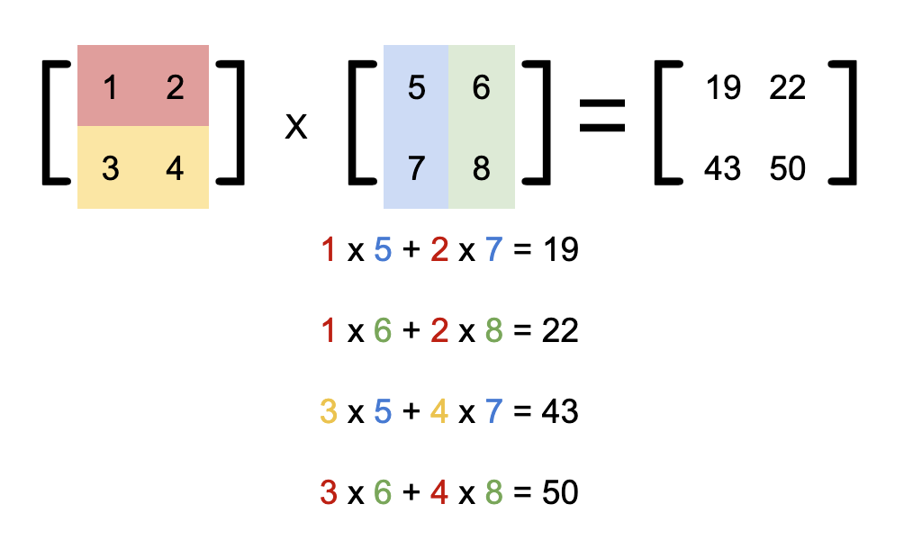

# Basic Concepts

$$|0\rangle = \begin{bmatrix} 1 \\ 0 \end{bmatrix}$$
$$|1\rangle = \begin{bmatrix} 0 \\ 1 \end{bmatrix}$$

$$\langle 0| = \begin{bmatrix} 1 & 0 \end{bmatrix}$$
$$\langle 1| = \begin{bmatrix} 0 & 1 \end{bmatrix}$$

e.g.

$$|0\rangle\langle 0| = \begin{bmatrix} 1 \\ 0 \end{bmatrix}\begin{bmatrix} 1 & 0 \end{bmatrix} = \begin{bmatrix} 1 & 0 \\ 0 & 0 \end{bmatrix}$$

$$|1\rangle\langle 1| = \begin{bmatrix} 0 \\ 1 \end{bmatrix}\begin{bmatrix} 0 & 1 \end{bmatrix} = \begin{bmatrix} 0 & 0 \\ 0 & 1 \end{bmatrix}$$

$$|0\rangle\langle 1| = \begin{bmatrix} 1 \\ 0 \end{bmatrix}\begin{bmatrix} 0 & 1 \end{bmatrix} = \begin{bmatrix} 0 & 1 \\ 0 & 0 \end{bmatrix}$$

$$|1\rangle\langle 0| = \begin{bmatrix} 0 \\ 1 \end{bmatrix}\begin{bmatrix} 1 & 0 \end{bmatrix} = \begin{bmatrix} 0 & 0 \\ 1 & 0 \end{bmatrix}$$

# 叠加态

$$|ψ\rangle = α|0\rangle + β|1\rangle$$

# 矩阵乘法

$$ \begin{bmatrix} a & b \\ c & d \end{bmatrix} \begin{bmatrix} e & f \\ g & h \end{bmatrix} = \begin{bmatrix} ae + bg & af + bh \\ ce + dg & cf + dh \end{bmatrix} $$

e.g.

$$ \begin{bmatrix} 1 & 2 \\ 3 & 4 \end{bmatrix} \begin{bmatrix} 5 & 6 \\ 7 & 8 \end{bmatrix} = \begin{bmatrix} 19 & 22 \\ 43 & 50 \end{bmatrix} $$
