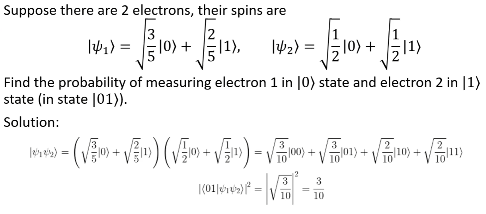
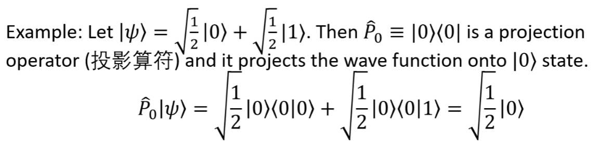

# 量子计算

# Complex Function

波函数可以看作向量  
A set of all **wave functions** is **vector space**. We can treat **wave functions** as **vectors**.

# Electron Spins (电子自旋)

H is a set of wave functions the describe electron spin in z-direction.

H = {Spin up, Spin down}  
$$|0\rangle = Spin\ up$$
$$|1\rangle = Spin\ down$$

|0> and |1> are called "qubit" (量子比特)

# Photon polarizations (光的偏振)

H = {Polarization Horizontal, Polarization Vertical}  
$$|0\rangle = Polarization\ Horizontal$$
$$|1\rangle = Polarization\ Vertical$$

|0> and |1> are called "qubit" (量子比特)

# Properties of Qubits

The qubits are normalized,
$$\langle0|0\rangle = 1, \langle1|1\rangle = 1$$
The qubits are orthogonal,
$$\langle0|1\rangle = 0, \langle1|0\rangle = 0$$

Sij = 0, i != j  
Sij = 1, i = j  
As same as **XNOR** in classical logic.  
**(同真异假)**

# Superposition of states (叠加态)

假设一个电子的自旋态为  
$$|ψ\rangle = α|0\rangle + β|1\rangle$$

Find the probability of measuring |0> or |1> state.  
Solution:  
P(0) = |<0|ψ>|^2 = |α|^2 = 1 - |β|^2  
P(1) = |<1|ψ>|^2 = |β|^2 = 1 - |α|^2  

# Tensor product (张量积)

$$ u⊗v = \begin{bmatrix} u_1 \\ u_2 \end{bmatrix} ⊗ \begin{bmatrix} v_1 \\ v_2 \end{bmatrix} = \begin{bmatrix} u_1 \begin{bmatrix} v_1 \\ v_2 \end{bmatrix} \\ u_2 \begin{bmatrix} v_1 \\ v_2 \end{bmatrix} \end{bmatrix} = \begin{bmatrix} u_1v_1 \\ u_1v_2 \\ u_2v_1 \\ u_2v_2 \end{bmatrix} $$

In quantum physics
$$
|ψ\rangle ⊗ |φ\rangle \equiv |ψ\rangle|φ\rangle \equiv |ψ, φ\rangle \equiv |ψφ\rangle
$$

Tensor product has the following properties:
$$(v+w)⊗u = v⊗u + w⊗u$$
$$u⊗(v+w) = u⊗v + u⊗w$$
$$c(v⊗u) = (cv)⊗u = v⊗(cu)$$

**Tensor product** is a **linear** operation.

Not commutative, order is important.

# Inner product (内积)

$$\langle φ_1φ_2|ψ_1ψ_2\rangle = \langle φ_1|ψ_1\rangle_1\langle φ_2|ψ_2\rangle_2$$

Where $\langle · | · \rangle_1$ and $\langle · | · \rangle_2$ are inner products in Hilbert spaces.

Example:
$$\langle 01|01\rangle = \langle 0|0\rangle\langle 1|1\rangle = 1 · 1 = 1$$
$$\langle 011|010\rangle = \langle 0|0\rangle\langle 1|1\rangle\langle 1|0\rangle = 1 · 1 · 0 = 0$$

e.g.
Suppose we have two qubits, |ψ> and |φ>.

# Outer product (外积)

$$|ψ\rangle\langleφ| = |ψ\rangle⊗\langleφ|$$

Outer product is used to produce operators.

e.g. 投影算符

# Eigenvalues and Eigenvectors (特征值和特征向量)

Let A be an operator or a matrix, and |ψ> be a vector.

$$A|ψ\rangle = λ|ψ\rangle$$

Then λ is called an eigenvalue of A, and |ψ> is called an eigenvector of A.

Example:
$$P \equiv |0\rangle\langle0|$$
Eigenvalues of P are 1 and 0, and eigenvectors are |0> and |1>.
$$P|0\rangle = |0\rangle\langle0|0\rangle = 1\ ·|0\rangle = |0\rangle$$
$$P|1\rangle = |0\rangle\langle0|1\rangle = 0\ ·|1\rangle = 0$$

p.s. $$|0\rangle\langle0|$$ be like a projection matrix.
$$|0\rangle\langle0| = \begin{bmatrix} 1 & 0 \\ 0 & 0 \end{bmatrix}$$

# Spectral theorem (谱定理)

$$A = \sum_{i=1}^n λ_i |ψ_i\rangle\langle ψ_i|$$

Where λi are eigenvalues of A, and |ψi> are eigenvectors of A.

# Completeness relation (完备关系)

$$I = \sum_{i=1}^n |ψ_i\rangle\langle ψ_i|$$

Where I is the identity matrix.
