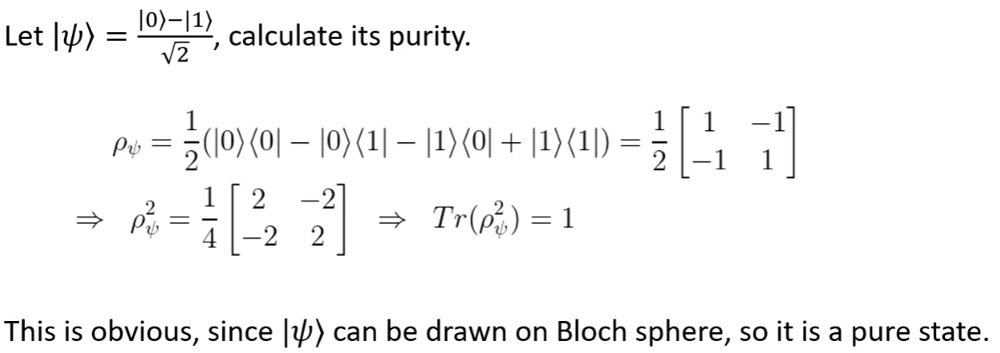

# Bloch Sphere and Density Operator

# Bloch Sphere(布洛赫球面)

$| \psi \rangle = a | 0 \rangle + b | 1 \rangle$, with $|a|^2 + |b|^2 = 1$

Using polar coordinates, we can represent $| \psi \rangle$ as

$$ | \psi \rangle = \begin{bmatrix} cos \frac{\theta}{2} \\ e^{i \phi} sin \frac{\theta}{2} \end{bmatrix} $$

# Visualization

```python
form qiskit.visualization import plot_bloch_vector
```

$$|0\rangle = cos \frac{0}{2} |0\rangle + e^{i 0} sin \frac{0}{2} |1\rangle$$

```python
theta = 0
phi = 0
x, y, z = sph2cart(theta, phi)
plot_bloch_vector([x, y, z])
```

$$|1\rangle = cos \frac{\pi}{2} |0\rangle + e^{i 0} sin \frac{\pi}{2} |1\rangle$$

```python
theta = np.pi
phi = 0
x, y, z = sph2cart(theta, phi)
plot_bloch_vector([x, y, z])
```

$$|\psi \rangle = cos \frac{\pi}{4} |0\rangle + e^{i \pi} sin \frac{\pi}{4} |1\rangle = \frac{|0\rangle + |1\rangle}{\sqrt{2}}$$

```python
theta = np.pi / 2
phi = 0
x, y, z = sph2cart(theta, phi)
plot_bloch_vector([x, y, z])
```

# Global and relative phase

$$ | \psi \rangle = e^{i \gamma} (
    cos \frac{\theta}{2} |0\rangle + e^{i \phi} sin \frac{\theta}{2} |1\rangle ) $$

Where $e^{i \gamma}$ is the global phase(全局相位，可以忽略), and $e^{i \phi}$ is the relative phase(相对相位，不可忽略).

* **Global phase DOES NOT affect anything, it could be ignored.**
* **Relative phase is important, DO NOT ignore it.**

# Unitary Operators(transformation)

Define a unitary operator $U$:

$$ U^{\dagger} U = U U^{\dagger} = I $$

Unitary operators preserve the length of the vector:

$$\|U|\psi \rangle\|^2 = \langle \psi | U^{\dagger} U |\psi \rangle = \langle \psi | \psi \rangle = \| |\psi \rangle \|^2$$

In other words, unitary operators keep quantum states on the Bloch sphere.

# Rotation about arbitrary axis

$$ R_{\hat{n}}(a)|\psi \rangle = \exp(-i \frac{a}{2} \hat{n} \cdot \vec{\sigma})|\psi \rangle $$

# Pure state and mixed state

* 布洛赫球面上的所有向量都是**纯态**
* 布洛赫球面内的向量都是**混合态**

All vectors on the surface Bloch sphere are **pure states**.

It can be written as:

$$ |\psi \rangle = \begin{bmatrix} cos \frac{\theta}{2} \\ e^{i \phi} sin \frac{\theta}{2} \end{bmatrix} $$

A **mixed state** is a vector inside the Bloch sphere.

# Density matrix and Bloch vector

For a pure state $|\psi \rangle$, density operator as:
$$ \rho = |\psi \rangle \langle \psi | $$

# Purity

$$ \gamma = Tr(\rho^2) $$

For example:

$$ \gamma = Tr(\begin{bmatrix} 1 & 0 \\ 0 & 0 \end{bmatrix}^2) = 1 $$

$$ \gamma = Tr(\begin{bmatrix} 1 * * \\ * 2 * \\ * * 3 \end{bmatrix}^2) = 6 $$

斜对角线相加即可

* Purity measures how much a state is mixed.
* $ \frac{1}{d} \leq \gamma \leq 1 $ where $d$ is the dimension of the Hilbert space.
* $\gamma = 1$ means a pure state.
* $\gamma = \frac{1}{d}$ means a completely mixed state.

Suppose $\vec{r_1}$ and $\vec{r_2}$ are the Bloch vectors of two **pure states** $|\psi_1\rangle$ and $|\psi_2\rangle$, 
then
$$
|\langle \psi_1 | \psi_2 \rangle|^2 = Tr(\rho_1 \rho_2) = \frac{1}{2} \left( 1 + \vec{r_1} \cdot \vec{r_2}\right)
$$

This formula relates the inner product in Hilbert space and the inner product in $\mathbb{R}^3$.


