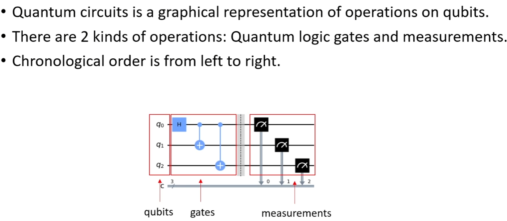
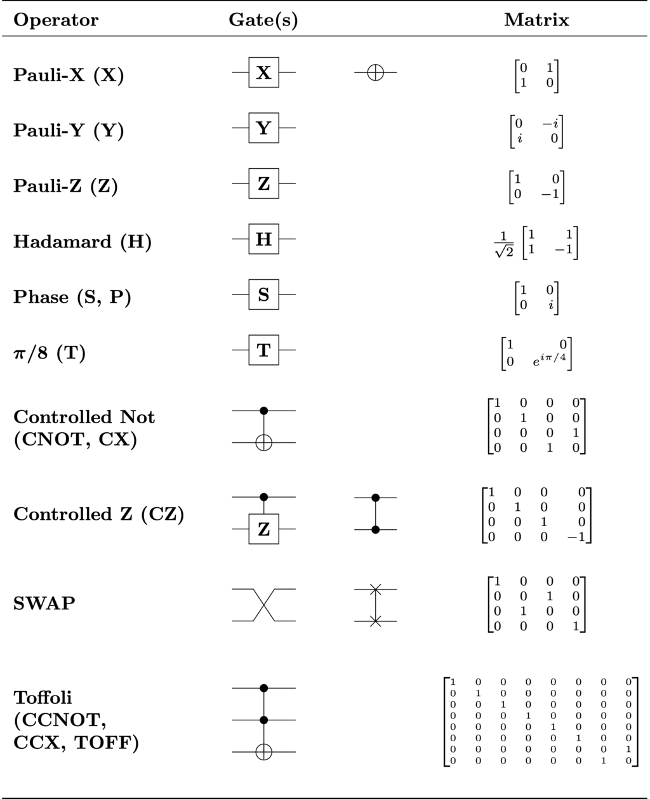
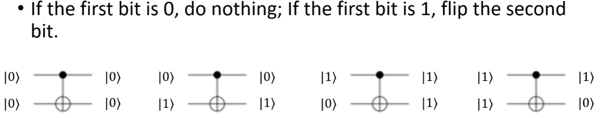

# Quantum Circuit(量子电路)

# Quantum Logic Gates(量子逻辑门)

# Pauli X Matrix(泡利X矩阵)

$$X = \begin{bmatrix} 0 & 1 \\ 1 & 0 \end{bmatrix}$$

Example:

Apply X to |0> and |1>:
$$X|0\rangle = \begin{bmatrix} 0 & 1 \\ 1 & 0 \end{bmatrix} \begin{bmatrix} 1 \\ 0 \end{bmatrix} = \begin{bmatrix} 0 \\ 1 \end{bmatrix} = |1\rangle$$
$$X|1\rangle = \begin{bmatrix} 0 & 1 \\ 1 & 0 \end{bmatrix} \begin{bmatrix} 0 \\ 1 \end{bmatrix} = \begin{bmatrix} 1 \\ 0 \end{bmatrix} = |0\rangle$$

# Hadamard Gate(哈达玛门)

创造叠加态的门

Apply H to |0> and |1>:
$$H|0\rangle = \frac{1}{\sqrt{2}}\begin{bmatrix} 1 & 1 \\ 1 & -1 \end{bmatrix} \begin{bmatrix} 1 \\ 0 \end{bmatrix} = \frac{1}{\sqrt{2}}\begin{bmatrix} 1 \\ 1 \end{bmatrix} = \frac{|0\rangle + |1\rangle}{\sqrt{2}}$$

$$H|1\rangle = \frac{1}{\sqrt{2}}\begin{bmatrix} 1 & 1 \\ 1 & -1 \end{bmatrix} \begin{bmatrix} 0 \\ 1 \end{bmatrix} = \frac{1}{\sqrt{2}}\begin{bmatrix} 1 \\ -1 \end{bmatrix} = \frac{|0\rangle - |1\rangle}{\sqrt{2}}$$

# Controlled-NOT Gate(CNOT, 控制非门)

Apply CNOT to |00>, |01>, |10>, |11>:

$$|00\rangle = \begin{bmatrix} 1 \\ 0 \\ 0 \\ 0 \end{bmatrix}
|01\rangle = \begin{bmatrix} 0 \\ 1 \\ 0 \\ 0 \end{bmatrix}
|10\rangle = \begin{bmatrix} 0 \\ 0 \\ 1 \\ 0 \end{bmatrix}
|11\rangle = \begin{bmatrix} 0 \\ 0 \\ 0 \\ 1 \end{bmatrix}$$

$$CX|00\rangle = \begin{bmatrix} 1 & 0 & 0 & 0 \\ 0 & 1 & 0 & 0 \\ 0 & 0 & 0 & 1 \\ 0 & 0 & 1 & 0 \end{bmatrix} \begin{bmatrix} 1 \\ 0 \\ 0 \\ 0 \end{bmatrix} = \begin{bmatrix} 1 \\ 0 \\ 0 \\ 0 \end{bmatrix} = |00\rangle$$

$$CX|01\rangle = |01\rangle$$
$$CX|10\rangle = |11\rangle$$
$$CX|11\rangle = |10\rangle$$

如果控制位为0，那么目标位不变，如果控制位为1，那么目标位取反。

# No-Cloning Theorem(不可克隆定理)

There is no unitary operator U on H ⊗ H such that for all normalized states $|\psi\rangle_A$ and $|e\rangle_b$ on H
$$ U(|\psi\rangle_A |e\rangle_B) = e^{ia(\psi, e)}|\psi\rangle_A |\psi\rangle_B$$

* 不可能构造一个能够完全复制任意量子比特，而不对原始量子位元产生干扰的系统。
* 量子信息在信道中传输，不可能被第三方复制而窃取信息而不对量子信息产生干扰。
