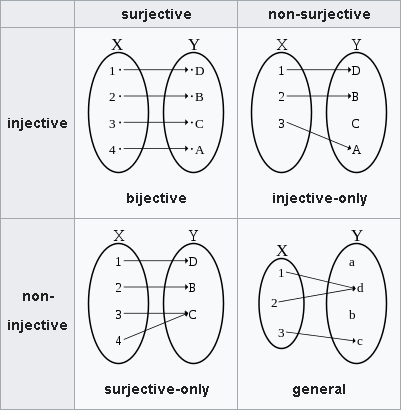

# Reversible Circuit(可逆电路)

# Reversible Function(可逆函数)

A function is reversible if and only if it is bijective.

只有当函数是双射时，函数才是可逆的。

# Reversible Circuits in classical computing(经典计算中的可逆电路)

* Gates in classical computing are not always reversible.

Example: NOT gate is reversible; AND gate is not reversible.

# Reversibliity in quantum computing(量子计算中的可逆性)

* Quantum circuits are ALWAYS reversible.

* Since all quantum gates are unitary matrix(酉矩阵), so by definition we know that every unitary matrix $U$ has a unique inverse $U^{\dagger}$.

Reverse of Hadamard gate

$$H|0\rangle = \frac{1}{\sqrt{2}}\begin{bmatrix} 1 & 1 \\ 1 & -1 \end{bmatrix}\begin{bmatrix} 1 \\ 0 \end{bmatrix} = \frac{1}{\sqrt{2}}\begin{bmatrix} 1 \\ 1 \end{bmatrix} = \frac{|0\rangle + |1\rangle}{\sqrt{2}}$$

$$H^{\dagger} \frac{|0\rangle + |1\rangle}{\sqrt{2}} = \frac{1}{\sqrt{2}}\begin{bmatrix} 1 & 1 \\ 1 & -1 \end{bmatrix} \frac{1}{\sqrt{2}}\begin{bmatrix} 1 \\ 1 \end{bmatrix} = \begin{bmatrix} 1 \\ 0 \end{bmatrix} = |0\rangle$$
